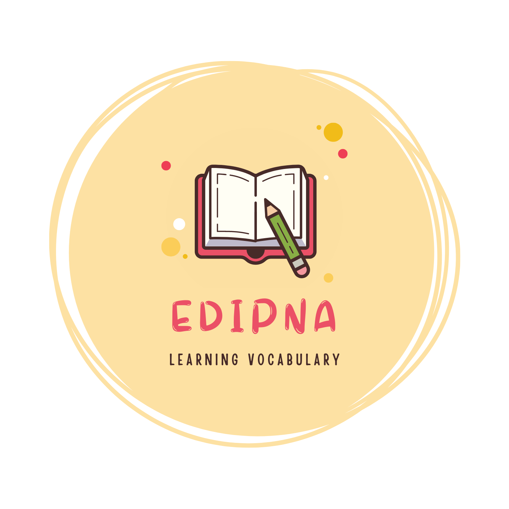

<h1 align="center"> 
</h1>
 

   

An app to practice vocabulary and improve your English using words from ICPNA books.

## INDICE

1. [Descripción del proyecto](#id1) 
2. [Estado del proyecto](#id2) 
3. [Características y demostración de la app web](#id3) 
4. [Acceso al Proyecto](#id4) 
5. [Tecnologías utilizas](#id5) 
6. [Peronas-Desarrolladores del Proyecto]("#id6) 
7. [Conclusión](#id7)

## Descripción del proyecto
Proyecto en desarrollo que utiliza las palabras del vocabulario de los libros del Instituto Cultura Peruano Norteamericano.  
Este proyecto permitirá a los estudiantes prácticar el vocabulario de los diferentes niveles de una manera fácil y rápida.

## Estado del proyecto
:construction: Proyecto en construcción :construction:

## Características de la aplicación y demostración
- `Funcionalidad 1`: La aplicación permite seleccionar los diferentes niveles del nivel Intermedio de la institución.
- `Funcionalidad 2`: La aplicación permite verificar si el texto ingresado es la traducción correcta.
- `Funcionalidad 3`: La aplicación va mostrando en pantallas cada palabra del vocabulario del nivel seleccionado.
- `Funcionalidad 3a`: Si la respuesta es correcta, la aplicación elimina la palabra.
- `Funcionalidad 3b`: Si la respuesta es incorrecta, la aplicación enviá la palabra al último lugar de la lista y la vuelve a mostrar cuando llegué su turno para ser visualizada.
- `Funcionalidad 4`: Si la respuesta ingresada por el usuario es correcta el sistema mostrará el mensaje "Correcto".
-`Funcionalidad 4a`: Si la respuesta ingresada por el usuario es incorrecta el sistema mostrará el mensaje "Incorrecto" y mostrará la respuesta correcta.
- `Funcionalidad 5`: Si se da click en el botón continuar la aplicación muestra la siguiente palabra en ingles de la lista para ser traducida.

## 📁 Acceso al proyecto 
El proyecto se encuentra libre para ser descargado y utilizarlo localmente.

## Tecnologías utilizadas
<ul>
<li>JavaScript</li>
<li>HTML</li>
<li>CSS</li>
</ul>